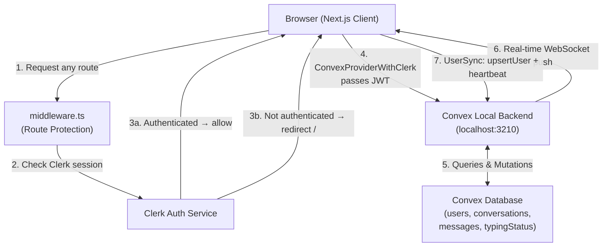
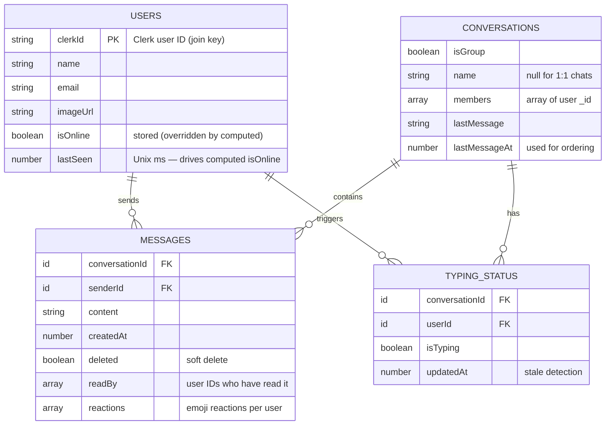
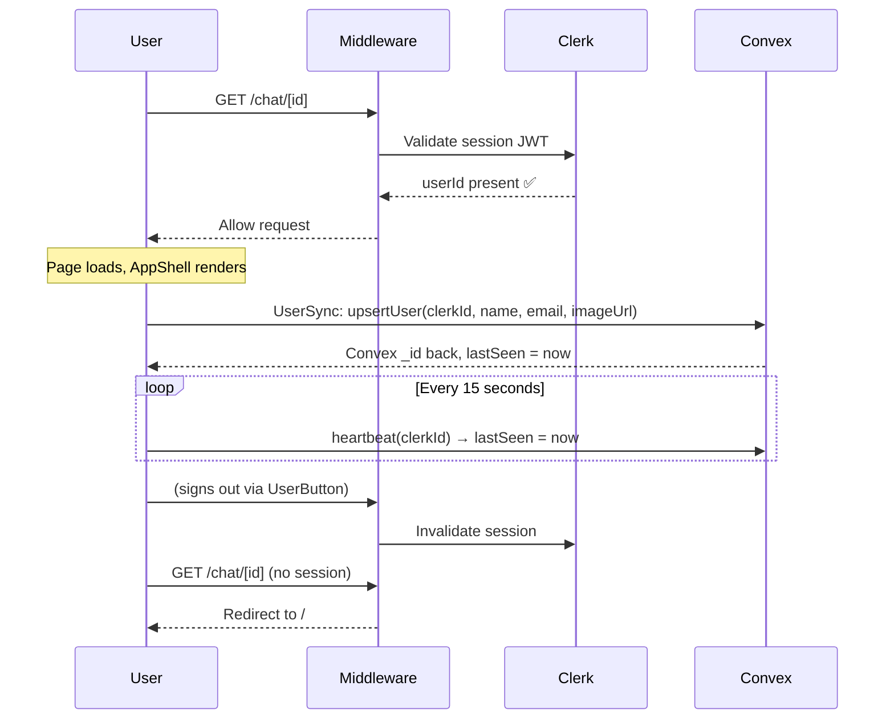
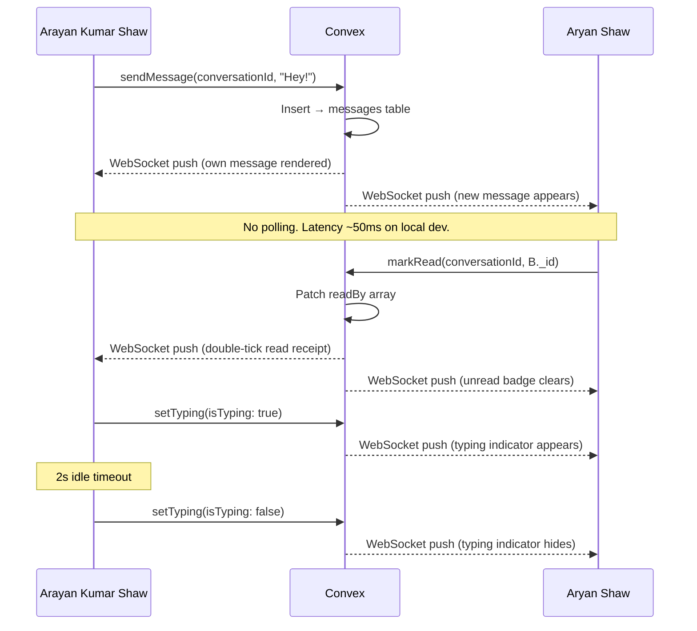

# TARS Chat — Complete Project Documentation

> A production-quality real-time 1:1 chat application built with Next.js, Convex, and Clerk.
> **Users:** Arayan Kumar Shaw & Aryan Shaw

---

## 🗂️ Project Structure

```
tars-chat/
├── app/                            # Next.js App Router
│   ├── layout.tsx                  # Root layout — ClerkProvider (outermost) + Providers
│   ├── page.tsx                    # Landing page (signed out) / AppShell (signed in)
│   ├── providers.tsx               # ConvexProviderWithClerk + TooltipProvider
│   ├── globals.css                 # Global styles + Tailwind base
│   └── chat/
│       └── [conversationId]/
│           └── page.tsx            # Dynamic chat route — renders AppShell with conversation
├── components/
│   ├── AppShell.tsx                # Auth layout: Sidebar + ChatWindow + UserSync
│   ├── Sidebar.tsx                 # Left panel: Chats tab, People tab, search, UserButton
│   ├── ConversationList.tsx        # Sidebar "Chats" tab — list of existing conversations
│   ├── UserList.tsx                # Sidebar "People" tab — all users you can message
│   ├── ChatWindow.tsx              # Main chat interface (messages, input, reactions)
│   ├── MessageBubble.tsx           # Individual message with emoji reactions + delete
│   ├── TypingIndicator.tsx         # Animated "..." when other user is typing
│   └── UserSync.tsx                # Syncs Clerk identity → Convex; runs heartbeat
├── convex/                         # Serverless backend (Convex)
│   ├── schema.ts                   # DB schema — single source of truth for all tables
│   ├── users.ts                    # upsertUser, heartbeat, setOnlineStatus, getMe, listUsers, getUserById
│   ├── conversations.ts            # getOrCreate, get, list
│   ├── messages.ts                 # send, list, markRead, react, softDelete
│   ├── typing.ts                   # setTyping, getTyping
│   └── seed.ts                     # cleanup mutation (removes test users)
├── lib/
│   ├── getOrCreateConversation.ts  # useGetOrCreateConversation hook
│   ├── formatTimestamp.ts          # Human-readable timestamp util
│   ├── guestAuth.tsx               # Deprecated stub (safe to delete)
│   └── utils.ts                    # cn() class merge helper (clsx + tailwind-merge)
├── middleware.ts                   # Clerk middleware — protects /chat/* routes
└── about_project.md                # This file
```

---

## ⚙️ Tech Stack

| Layer | Technology | Version | Purpose |
|---|---|---|---|
| **Framework** | Next.js | 16 (App Router) | SSR + client components, routing |
| **Language** | TypeScript | 5.x (strict) | Full type safety, zero `any` |
| **Backend / DB** | Convex | Latest | Real-time serverless DB + WebSocket sync |
| **Auth** | Clerk | Latest | Google OAuth + Phone/SMS OTP |
| **Styling** | Tailwind CSS | 3.x | Utility-first CSS |
| **UI Components** | shadcn/ui | Latest | Avatar, Badge, Button, Input, Tooltip |
| **Icons** | Lucide React | Latest | Consistent icon set |
| **Font** | Inter (Google Fonts) | — | Clean modern sans-serif typography |

---

## 🏗️ System Architecture



---

## 🗄️ Database Schema



---

## 🔐 Authentication

### Provider — Clerk

**Two sign-in methods:**

| Method | Flow |
|---|---|
| **Google OAuth** | One-click → Google consent screen → JWT session |
| **Phone / SMS OTP** | Enter phone number → 6-digit SMS code → JWT session |

### Auth Architecture



### Route Protection Rules

| Route | Status | Behavior |
|---|---|---|
| `/` | Public | Shows landing page with sign-in buttons |
| `/sign-in/*` | Public | Clerk sign-in flow |
| `/sign-up/*` | Public | Clerk sign-up flow |
| `/chat/*` | **Protected** | Must be signed in — redirected to `/` if not |
| `/api/*` | Protected | Requires Clerk session |

### ClerkProvider Setup

```
app/layout.tsx
└── <ClerkProvider>           ← outermost — provides Clerk context to entire tree
    └── <html>
        └── <body>
            └── <Providers>   ← ConvexProviderWithClerk (binds Convex to Clerk JWT)
                └── <TooltipProvider>
                    └── {children}
```

---

## 💬 Features

### Core Chat
- **Real-time 1:1 messaging** — Convex WebSocket delivers messages to all subscribers instantly, zero polling
- **No duplicate conversations** — `getOrCreate` sorts member IDs lexicographically before creating/querying, preventing duplicate 1:1 chats
- **Chronological message history** — sorted by `createdAt`, grouped by date with separators
- **Soft delete** — deleted messages stay in DB, displayed as `[deleted]`

### Presence System (Heartbeat Architecture)

`isOnline` is **computed from `lastSeen`, never directly stored as boolean state:**

```
isOnline = Date.now() - lastSeen < 30_000
```

| Event | Action |
|---|---|
| User logs in | `upsertUser` → `lastSeen = now` |
| Every 15 seconds | `heartbeat` → `lastSeen = now` |
| Tab close (`beforeunload`) | `setOnlineStatus(false)` → `lastSeen = 0` |
| Tab crash / network loss | `lastSeen` goes stale → expires after 30s automatically |

**Why not boolean?** React's StrictMode and HMR remount effects on every hot-reload. Using a boolean `isOnline = false` on cleanup caused flicker to "Offline" on every code save. The threshold-based approach is immune to this.

### Unread Message Counts
- Each message has a `readBy: Id<"users">[]` array
- `markRead` mutation is called whenever a conversation is opened
- Sidebar badge = messages where `!readBy.includes(me._id)`, capped at `99+`

### Typing Indicator
- `setTyping(isTyping: true)` fires on each keystroke
- **2-second idle timeout** auto-resets it after the user stops typing
- `setTyping(isTyping: false)` fires immediately on message send
- Stored in ephemeral `typingStatus` table, filtered to exclude current user

### Emoji Reactions
- Per-message reactions: `{ userId, emoji }[]` stored in message document
- Hover a message → emoji picker appears
- Clicking a reaction toggles it (add if absent, remove if already reacted)
- De-duplicated per user per emoji

### Search
- Search input triggers queries to `listUsers` / `conversations.list`
- **300ms debounce** prevents a new Convex subscription on every keystroke
- Raw `search` state updates UI instantly; `debouncedSearch` drives the query

### Loading & Error UX
| State | Component | Behavior |
|---|---|---|
| Messages loading | `MessageListSkeleton` | Shimmer bubble placeholders |
| Conversation list loading | `ConversationSkeleton` | Shimmer rows |
| User list loading | `UserSkeleton` | Shimmer avatar rows |
| Send in progress | `isSending` | Button disabled, spinner |
| Send failed | `sendError` | Red banner, input restored |
| Chat header loading | Inline skeleton | Name + status shimmers |

---

## 🔄 Real-time Message Flow



---

## ⚡ Performance Optimizations

| Technique | Where | Why |
|---|---|---|
| `React.memo()` | `ConversationSkeleton`, `UserSkeleton`, `EmptyChatState`, `DateSeparator` | Prevents re-render when parent state changes |
| `useCallback` | `handleSend`, `handleInputChange`, `handleKeyDown`, `scrollToBottom` | Stable references prevent child re-renders |
| Search debounce (300ms) | `Sidebar` → `debouncedSearch` state | Reduces Convex query subscriptions |
| Lexicographically sorted member IDs | `conversations.ts:getOrCreate` | Prevents duplicate 1:1 conversations |
| `IntersectionObserver` | `ChatWindow` bottom sentinel | Native scroll tracking, no JS scroll listeners |
| Mutation refs in `UserSync` | `useRef(useMutation(...))` | Prevents infinite `useEffect` re-run loop |
| Heartbeat not boolean | `lastSeen` threshold | Immune to React HMR remount flicker |

---

## 🛠️ Developer Commands

| Command | Purpose |
|---|---|
| `npx convex dev` | Start local Convex backend on port 3210 (hot-reload) |
| `npm run dev` | Start Next.js dev server on port 3000 |
| `npx tsc --noEmit` | TypeScript strict check (must exit 0) |
| `npm run build` | Production build verification |
| `npx convex run seed:cleanup` | Remove test/seed users, keep real users only |

---

## 🌐 Environment Variables

| Variable | Side | Required | Description |
|---|---|---|---|
| `NEXT_PUBLIC_CONVEX_URL` | Client | ✅ | Convex deployment URL (local: `http://127.0.0.1:3210`) |
| `NEXT_PUBLIC_CLERK_PUBLISHABLE_KEY` | Client | ✅ | Clerk frontend key — safe to expose |
| `CLERK_SECRET_KEY` | **Server only** | ✅ | Clerk backend key — never exposed to client |
| `CONVEX_DEPLOYMENT` | Server | Auto | Set by `npx convex dev` |

> `.env.local` is listed in `.gitignore` under `.env*` — keys are never committed.

---

## 🐛 Bugs Fixed During Development

| Bug | Root Cause | Fix |
|---|---|---|
| Presence always "Offline" | `useEffect` cleanup called `setOnlineStatus(false)` — React HMR remounts on every save | Removed explicit offline call from cleanup; rely on 30s heartbeat expiry |
| Presence "Offline" on chat page | `UserSync` only rendered on `/` route. Navigating to `/chat/[id]` unmounted it → heartbeat stopped | Moved `UserSync` into `AppShell` (renders on all authenticated routes) |
| Route protection was a no-op | `clerkMiddleware()` alone doesn't protect routes; needs explicit `auth.protect()` call | Added `createRouteMatcher` + `userId` check → redirect to `/` if unauthenticated |
| Hydration crash (production build) | `SetupScreen` in `providers.tsx` rendered `<html><body>` inside a client component | Replaced with a plain `<div>` — `layout.tsx` owns the HTML skeleton |
| `useEffect` infinite re-run loop | `useMutation()` returns a new reference every render — putting in deps caused continuous re-execution | Stored mutations in `useRef` — effect only re-runs when `user?.id` changes |

---

## ✅ Production Readiness Checklist

- [x] `tsc --noEmit` → EXIT:0
- [x] `npm run build` → EXIT:0
- [x] Route protection (unauthenticated `/chat/*` → redirect to `/`)
- [x] No `<html><body>` in client components
- [x] No memory leaks (`clearInterval` + `removeEventListener` in cleanup)
- [x] `isSending` prevents double-submission
- [x] `.env.local` in `.gitignore`
- [x] `CLERK_SECRET_KEY` never reaches the client
- [x] No hardcoded secrets in source
- [x] Heartbeat immune to HMR flicker

---

*Built by Arayan Kumar Shaw · 2026*
